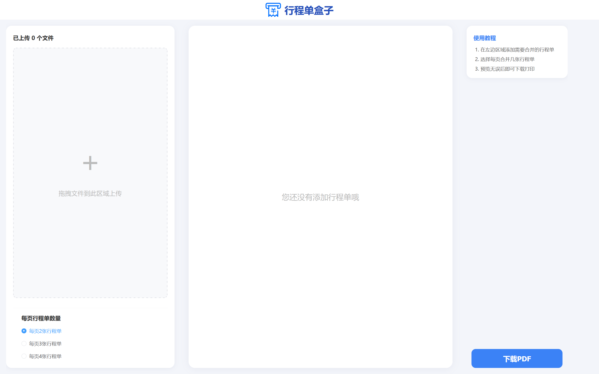

# ItineraryBox（行程单盒子） v1.0

一个基于Vue + Element的行程单打印合并工具。

## 演示



## 功能特性

### v1.0 核心功能
- **行程单打印合并**: 支持将多张行程单合并到一页进行打印，节省纸张和打印成本
  - 自动优化行程单在页面中的排列
  - 支持不同尺寸行程单的混合排列
  - 一键批量导入行程单文件
  - 支持打印前效果预览
  - 自定义每页行程单数量

### 技术特性
- 纯前端运行，无需服务端
- 用户友好的界面
- 响应式设计

## 快速开始

### 方法一：直接运行
双击 `public/index.html` 即可直接在浏览器中运行

### 方法二：开发模式
```bash
npm install && npm run serve
npm run build
```

## 赞助商

本项目 CDN 加速及安全防护由 Tencent EdgeOne 赞助

[亚洲最佳CDN、边缘和安全解决方案 - Tencent EdgeOne](https://edgeone.ai/zh?from=github)

[](https://edgeone.ai/zh?from=github)

## 许可证

MIT